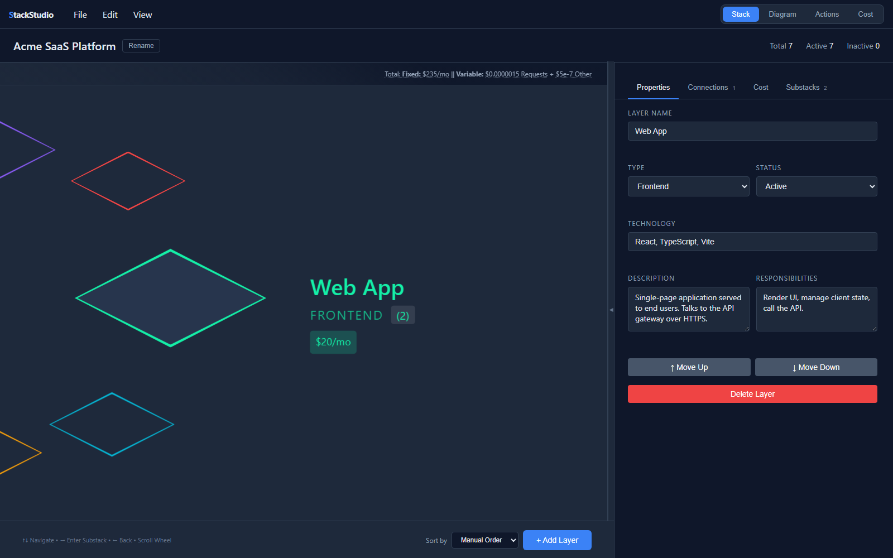
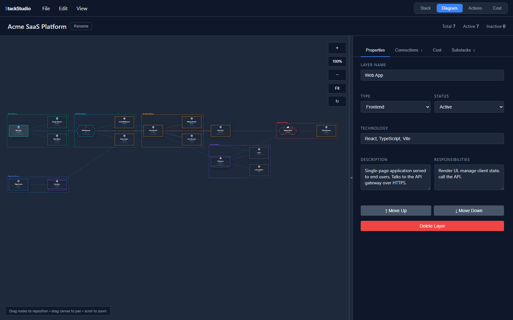
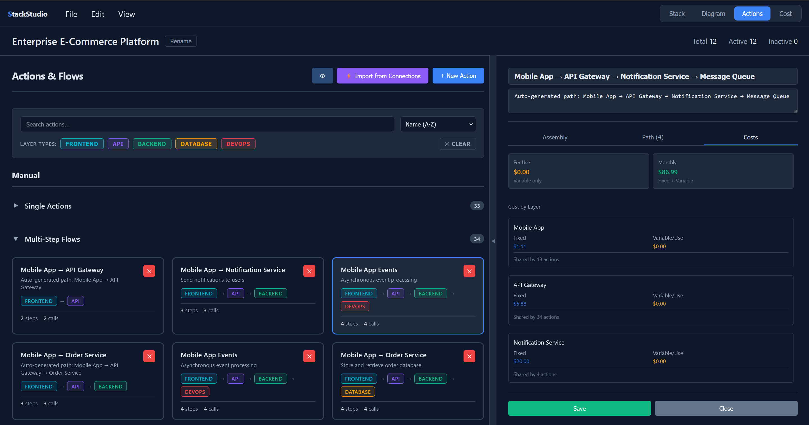
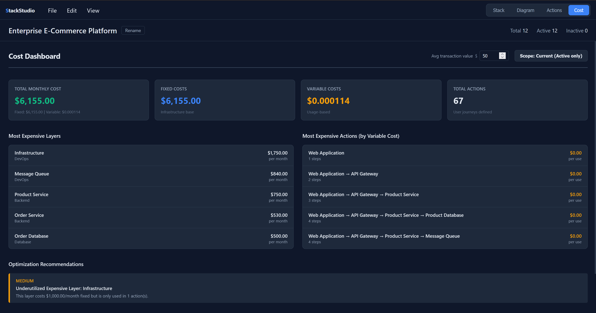

# StackStudio

## Architecture & Tech-Stack Visualizer

[](LICENSE)

**StackStudio** is a client-side web app for visualizing and organizing
software architectures. It is a fork and rework of
[ztack](https://github.com/Oddzac/ztack), focused on correctly handling
real-world stack layouts and diagrams. Built with vanilla JavaScript and the
HTML5 Canvas — no build step, no framework, no server.

It offers four synchronized views over a single project model:

- **Stack** — a rotary carousel of layers; drill into substacks (nested to any
  depth) with a breadcrumb in the details panel.
- **Diagram** — a draggable C4-style architecture diagram with typed, labeled
  connections, recursive substack grouping, snap-to-grid, multi-select group
  dragging, group-aware auto-arrange, action-path highlighting, two layout
  modes (**Stack** composition and **Flow** process lanes), and
  ultra-high-resolution PNG export.
- **Actions** — named request paths traced across layers, with cost-per-operation.
- **Cost** — a roll-up of per-layer fixed, variable, and percentage-of-value
  costs, with a Current/Projected scope toggle and a per-transaction view.
---



---



---



---



---

## Run it

Fully client-side. Serve the folder with any static server:

```bash
# Python
python -m http.server 8777

# Node
npx http-server -p 8777
```

Then open `http://localhost:8777`. Opening `index.html` directly works too,
though loading the bundled templates requires being served over `http://`.

## Data model

A project is a JSON document:

```jsonc
{
  "name": "My System",
  "layers": [
    {
      "id": 1,
      "name": "API Gateway",
      "type": "API",                 // Core|Frontend|Backend|Database|DevOps|API|Actor|External|Other
      "status": "Active",            // Active|Inactive|Deprecated|Planned|Proposed
      "technology": "Express.js",
      "description": "...",
      "responsibilities": "...",
      "connections": [               // canonical form: array of objects
        { "targetId": 2, "type": "HTTP", "label": "what flows here (optional)" }
      ],
      "costModel": { "currency": "USD", "period": "month",
                     "fixedCost": 400, "variableCost": 0.00002,
                     "variableUnit": "per-request" },
      "substacks": [ /* same shape, nested to any depth */ ]
    }
  ],
  "diagramPositions": { "1": { "x": 200, "y": 200 } }  // saved node positions
}
```

Connections are stored as `{ targetId, type }` objects, with an optional
`label` describing what data flows across the edge (shown on the diagram and
in the connection tooltip). Legacy numeric and parallel-array forms are
migrated automatically on load.

**Node types** include the infrastructure types plus `Actor` (external person,
drawn with a person glyph) and `External` (third-party system) — both excluded
from cost rollups. **Statuses** include `Planned` and `Proposed` for roadmap
nodes, which render with a dashed border and a status pill so a single diagram
can show current + future state.

The real-world sample in `samples/sample-saas.json` is used by the test suite.

See **[SCHEMA.md](SCHEMA.md)** for the complete project schema reference —
every field, enum, the cost model (including percentage-of-value costs), and
the migration rules.

## Using it

- **Add / edit layers** in the Stack view or via the details panel on the
  right. The panel has Properties, Connections, Cost and Substacks tabs; the
  open tab is preserved as you edit. The panel collapses (handle on its edge)
  and is horizontally resizable (drag its left edge).
- **Diagram view**: drag nodes to reposition them (positions are saved with
  the project), drag the canvas to pan, scroll to zoom. The toolbar (top-right)
  has zoom, Fit, Auto-arrange (↻), and Export (⬇) controls. A **Snap to grid**
  toggle (top-left, with a 5–20px size picker) aligns dragged nodes to a grid
  and shows it while on. Connection lines are labeled with their type; hover a
  node for a tooltip with its name, type, description and connections. When an
  action is selected, a dropdown (top-left) highlights its path across the
  diagram.
  - **Multi-select & group drag**: Ctrl/Cmd+click toggles nodes into a
    selection; dragging any selected node moves the whole set together.
    Alt+drag a node grabs its entire subtree (node + all descendants) as one
    movable group. Selected nodes get a dashed highlight ring; Escape or an
    empty-canvas click clears the selection.
  - **Auto-arrange** (↻) relays out the stack and then pushes overlapping
    top-level group boxes apart so the dashed group borders never intersect.
    It's a single undo step and doesn't disturb the layout unless you press it.
  - **Export** (⬇) saves an ultra-high-resolution PNG **plus a companion
    Markdown legend** (`<name>_legend.md`) documenting every node — name, type,
    status, technology, description, and outgoing connections — grouped by
    phase. The image aspect ratio is exactly the bounding box of every element
    (nodes + group boxes) plus 20px padding — no viewport crop or whitespace.
    Renders at 4× and caps the longest side at 12000px to stay within browser
    limits.
  - **Layout modes** (the **Flow / Stack** toggle): StackStudio carries two
    orthogonal kinds of meaning, and the diagram can lay out either way:
    - **Stack** (composition) — the default. Substacks nest to the right of
      their parent inside dashed group boxes. Right for architectures where a
      service *owns* its sub-modules.
    - **Flow** (process) — a layered top→bottom layout like a Mermaid
      flowchart. Nodes are ranked by edge direction; nodes sharing a `group`
      are packed into labeled **phase lanes**; edges are drawn as **orthogonal
      (right-angle) connectors** that exit the bottom of a node and enter the
      top of the next, fanned out into separate lanes so they don't overlap on
      hubs; feedback/back-edges route around the side without breaking ranking.
      Right for pipelines where data *passes through* stages. A Mermaid import
      switches here automatically.
- **File menu**: New, Open (import JSON), **Import Mermaid…** (convert a
  `flowchart`/`graph` definition — see below), Save (export JSON), and
  Templates. Projects auto-save to `localStorage`.

### Importing Mermaid

**File → Import Mermaid…** converts a Mermaid `flowchart` / `graph` definition
into a StackStudio project:

- `subgraph ID["Title"] … end` → the subgraph becomes a **phase/lane** (a
  `group` tag); the nodes inside it stay flat top-level nodes tagged with that
  group — not nested substacks. (A flowchart is a process graph, not a
  composition tree, so containment would misrepresent it.)
- bare nodes outside any subgraph → ungrouped top-level nodes.
- node shape → layer type, best-effort: `[(db)]` → Database, `{gw}` /
  `{{hex}}` → API, `([stadium])` / `[[subroutine]]` → Core, `((circle))` →
  Actor, `(rounded)` → Backend, `[rect]` → Other.
- edges (`-->`, `-- text -->`, `-.->`, `==>`), chains (`A --> B --> C`), and
  fan-out (`A --> B & C`) → connections. Dotted edges map to **Async**; edge
  text becomes the connection label. A subgraph-level edge (`SRC --> COOKIE`)
  expands to edges from each member node.

The import opens in **Flow layout** with the subgraphs as phase lanes. The
converter lives in `static/js/mermaid-import.js` and is pure/dependency-free.

### Keyboard & navigation

| Input | Action |
|-------|--------|
| ↑ / ↓ | Navigate layers (Stack view) |
| → / ← | Enter / exit a substack |
| Mouse wheel | Scroll layers (Stack) / zoom (Diagram) |
| Drag node | Reposition (Diagram) |
| Ctrl/Cmd+click node | Toggle node in multi-selection (Diagram) |
| Alt+drag node | Grab + move the node's whole subtree (Diagram) |
| Drag canvas | Pan (Diagram) |
| Ctrl+Z / Ctrl+Y | Undo / Redo |
| Escape | Clear diagram multi-selection |

## Actions

An **action** is a named operation traced through the stack — a request path
like *User Login* or *Checkout Flow*. Actions answer two questions a static
diagram can't:

1. **What does this operation touch?** Each action lists the layers it hits in
   order, so a path is documentation a new engineer can read.
2. **What does it cost?** Combining each layer's variable cost with how many
   times the action calls it (× monthly volume) turns the per-layer Cost view
   into real cost-per-operation math.

Selecting an action highlights its path on the Diagram view (the rest of the
stack dims), so you can see the operation flow through the architecture.

Actions are stored on the project under `usePaths` and are saved/exported with
everything else. Assembly edits (adding a layer, changing call counts)
auto-save — no separate Save step required.

## Architecture

```
index.html              entry point, markup, script load order
static/css/style.css    all styling
static/js/
  utils.js              HTML escaping + canonical connection accessor (loads first)
  data.js               data model, migrations, cost engine, templates
  mermaid-import.js     Mermaid flowchart → project converter (pure)
  validation.js         project validation
  views/
    stackView.js        renderLayers — the carousel
    detailsView.js      renderLayerDetails — the right panel
    actionsView.js      renderActionsView — flows
    costDashboardView.js renderCostDashboard
  app.js                state, view switching, selection, navigation, undo/redo
  diagram.js            canvas rendering, layout, drag, zoom/pan
```

Each renderer is defined in exactly one place (the `views/` modules are the
single source of truth — see the changelog for why this matters).

## Testing

Zero-dependency checks under `samples/` (dev server must be running on
`:8777` for the browser ones):

```bash
node samples/validate.mjs        # data layer: migration, connections, escaping
node samples/check-wiring.mjs    # static: no dup functions, handlers resolve
node samples/smoke.mjs           # headless Chrome: boots, loads sample, all views
node samples/check-diagram.mjs   # headless: layout, edges, drag persistence
node samples/check-actions.mjs   # headless: action persistence + diagram path highlight
node samples/check-schema.mjs    # headless: Planned status, Actor type, connection labels
node samples/check-cost.mjs      # headless: percentage costs + status-aware rollup
node samples/check-nesting.mjs   # headless: recursive substacks (layout, cost, deep nav)
node samples/check-stack-layout.mjs # headless: no overlap, no exponential, no ghost
node samples/check-snap.mjs      # headless: snap-to-grid toggle, rounding, realign
node samples/check-undo.mjs      # headless: field/drag undo, Ctrl+Z inside inputs
node samples/check-group-drag.mjs # headless: multi-select, group drag, group-aware arrange
node samples/check-export.mjs    # headless: hi-res PNG export bounds, aspect, restore
node samples/check-mermaid.mjs   # pure: Mermaid → project conversion (shapes, edges, fan-out)
node samples/check-flow.mjs      # headless: Flow layout ranks, phase bands, back-edges
node samples/check-ortho.mjs     # headless: orthogonal edge routing in Flow mode
node samples/shoot.mjs <view>    # screenshot a view to samples/shots/
```

## Changelog (fork from ztack)

This fork prioritized correctness on real stacks over new features:

- **HTML escaping everywhere.** Names, descriptions and other text are now
  escaped before insertion. Real data (quotes, backticks, angle brackets)
  previously corrupted inputs and the diagram, and was an injection vector.
- **One connection format.** Standardized on `{ targetId, type }` objects (the
  format real exports use). The old migration converted *toward* a
  parallel-array form that the rest of the app didn't read.
- **Real node dragging.** The diagram now supports drag-to-reposition with
  positions persisted on the project — previously advertised but never
  implemented. Layout is computed once (and on structural change), not every
  frame, so drags survive and the CPU isn't pegged.
- **No more duplicate renderers.** An earlier refactor left `renderLayers`,
  `renderActionsView` and `updateActionsListOnly` defined in both `app.js`
  and their view module; `app.js` loaded last and silently shadowed the
  modules. The duplicates were removed.
- **Details panel** keeps your active tab across edits and only re-renders
  other views when a label-affecting field changes.
- **Robustness**: `zoomToFit` no longer divides by zero (NaN → blank canvas),
  canvas listeners bind once, and per-frame `console.log` spam was removed.
- **Cleanup**: removed the non-functional Flask stub, the unused `config.js`,
  the committed `debug.log`, and inline-styled menus (now CSS classes).
- Added on-canvas connection-type labels and an Auto-arrange control.

### Since the initial fork

Feature and correctness work layered on after the rework, each with a
headless test under `samples/`:

- **n-level substacks.** The data model, cost rollup, diagram layout
  (recursive grouping boxes, content-aware column spacing, row wrapping for
  wide stacks) and details-panel navigation (drill-in with a breadcrumb) all
  handle arbitrary nesting depth.
- **Lifecycle status + node types.** `Planned`/`Proposed` statuses (dashed,
  excluded from current-state cost) and `Actor`/`External` node types (person
  glyph, excluded from cost).
- **Connection payload labels.** Optional per-edge "what flows here" label,
  rendered on the edge and in the tooltip.
- **Cost model.** Percentage-of-transaction-value costs (`percentageCost` +
  `percentageFixed` against a project `avgTransactionValue`) and a
  Current/Projected scope toggle that includes or excludes future nodes.
- **Actions.** Defined purpose (what an operation touches + costs), assembly
  edits auto-save, the diagram shows an action-path **dropdown** to switch or
  clear the highlighted path, and the list renders actions of any `source`.
- **Diagram UX.** Snap-to-grid (5–20px) with a grid overlay; edge-clipped
  connection routing. **Multi-select** (Ctrl/Cmd+click) with **group dragging**
  — move a whole selection or Alt+grab a node's entire subtree together.
  **Group-aware auto-arrange** that separates overlapping top-level group boxes
  so the dashed borders never intersect. **Ultra-high-res PNG export** framed
  exactly to all elements + 20px padding (4×, capped at 12000px).
- **Undo/redo robustness.** Node drags (single and group) are undoable, the
  auto-arrange is one undo step, and Ctrl+Z while a form field is focused
  commits the field's edit then runs the app undo (instead of dead-ending in
  the browser's native text-undo).
- **Mermaid import.** File → Import Mermaid converts a `flowchart`/`graph`
  definition into a project — subgraphs become **phase lanes** (a `group` tag),
  their nodes stay flat, node shapes map to types, and edges (incl. chains,
  fan-out, dotted, and labeled) become typed connections.
- **Flow vs. Stack layout.** The diagram has two layout modes: Stack
  (composition — substacks nested in group boxes) and Flow (process — nodes
  ranked top→bottom by edge direction with labeled phase lanes, à la a Mermaid
  flowchart, with phase-aware ranking so feedback loops don't interleave the
  lanes, and **orthogonal right-angle edge routing** fanned across ports so
  hub edges don't overlap). Toggle in the diagram toolbar; persisted per
  browser.
- **Sidebar.** Horizontally resizable (persisted), collapse handle glued to
  the panel edge, responsive width.
- **Stack view fixes.** No ghost-card flash on entry, word-boundary wrapping
  for long names, no name/cost overlap, plain-decimal cost formatting (no
  `3e-7`).

## License

MIT — see [LICENSE](LICENSE). Original work © the ztack authors.
