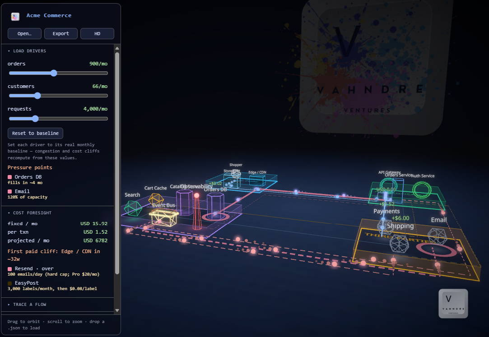
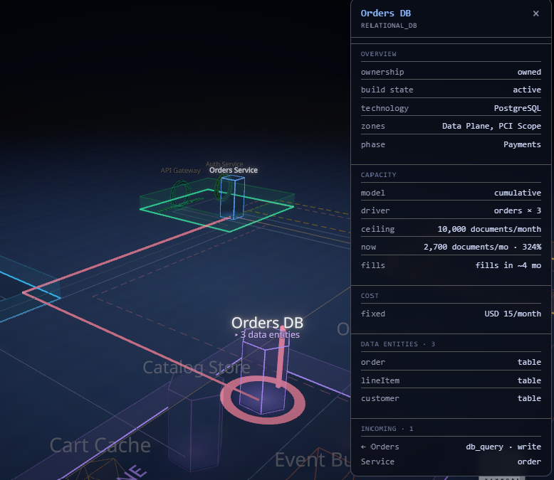
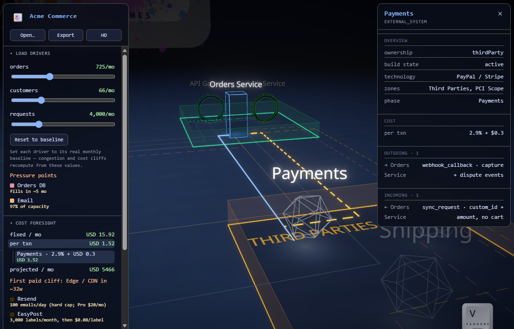

# StackStudio

## A 3D "city planner" for software architecture

StackStudio renders a software architecture as an explorable **neon city**: every
component is a building, every call is traffic on the roads, trust zones are
districts, and the whole thing is a live model you can trace, scrub, and cost.

It is a **React + WebGL** application (a deliberate rewrite of the original
vanilla-JS/Canvas tool — see *History* below). The runnable app lives in
[`app/`](app/); the durable data contract lives in
[`MODEL.md`](MODEL.md) + [`model/types.ts`](model/types.ts).



### The four things it exists to show

1. **Trace calls, evocatively** — pick a flow and glowing pulses (comet beads)
   travel its route through the city; a running cost ticker rides along.
2. **Scale limits, honestly** — congestion heat + per-building load meters +
   driver-term free-tier cliffs show where the architecture strains, not just
   that boxes connect.
3. **Pricing, in real terms** — per-operation "toll" along a traced flow, a
   whole-project **projected / mo** that scales with the load sliders, and a
   fixed/per-txn rollup that drills down to the contributing nodes.
4. **Live build progress** — a phase scrubber fills the city in over time,
   `in_progress` nodes show an animated construction scaffold, and selecting a
   phase spotlights its **blast radius**.

Legibility is the first-order constraint: **semantic-zoom LOD** (metropolis →
alleyway) reveals detail as you descend and collapses to labeled districts when
you pull back, so you can follow every call without overcrowding.

| | |
|---|---|
|  |  |
| **Detail on demand + honest scale** — click any node: capacity vs. ceiling (here **324% over → fills in ~4 mo**), cost, and the store's `data_entity` rooms. | **Pricing, drilled down** — trace a flow and break the per-transaction cost to the responsible node (PayPal **2.9% + $0.30**). |

---

## Run it

The app is a Vite project in [`app/`](app/):

```bash
cd app
npm install
npm run dev        # dev server
npm run build      # tsc + vite build (production bundle)
npm run typecheck  # tsc --noEmit
npm test           # vitest (pure model/engine tests)
```

Open a project with **Open…** (or drag a `.json` onto the window). It auto-loads
a generic e-commerce sample on first run. **HD / Lite** toggles rendering
quality (auto-detected on first visit — see *Quality tiers*).

> **Dev-env note (this machine):** npm defaults to a private registry that 401s
> on public installs. Prefix commands with
> `$env:npm_config_registry='https://registry.npmjs.org/'` (PowerShell). Do not
> edit the user-level `.npmrc`.

---

## Data model (the durable asset)

A project is a **v2 JSON document** — a graph of `nodes` + `edges`, with `zones`
(overlays), `flows` (traffic routes), `phases` (build timeline), `drivers`
(baseline monthly activity), and a `cost` model per node. Design law:
**closed trunk, open leaf** — every entity has a closed `kind` plus an open
`subtype` + `meta`, so new component types never require a schema change.

- **[`MODEL.md`](MODEL.md)** — the authoring contract and reasoning: node/edge/
  zone kinds, the load model (`capacity.usage`, multi-driver `usage.plus`), the
  cost model (meters/tiers, `transactionFees`, `Meter.perOp`, per-op toll,
  full-future-state doctrine), the naming ruleset, and the LOD rendering
  contract. **This is what an authoring agent reads.**
- **[`model/types.ts`](model/types.ts)** — the machine-readable TypeScript
  contract (`@model/*` alias). `MODEL_VERSION = 2.0.0`.

Legacy documents (the old Layer/Connection schema in [`SCHEMA.md`](SCHEMA.md),
Mermaid, etc.) are brought in through **import maps** (`app/src/model/legacyImport.ts`),
not migrations — they adapt *to* the v2 model. `SCHEMA.md` is retained only as
the legacy reference; `MODEL.md` supersedes it.

---

## Architecture (where the code lives)

```
stack-studio/
  MODEL.md            v2 data contract (authoring reference)
  SCHEMA.md           legacy schema (historical reference)
  ROADMAP.md          path to the hosted portal
  model/types.ts      canonical v2 TypeScript types  (@model)
  app/
    src/
      App.tsx         thin composition shell (Canvas + Sidebar + overlays)
      store.ts        Zustand store — all app state + actions + quality/paint
      model/          PURE engines (unit-tested with vitest):
        costForesight.ts  free-tier cliffs + fixed/txn rollup + contributors
        opCost.ts         per-operation toll, flowCost, projectMonthly
        usage.ts          driver-linked usage/congestion (multi-driver)
        load.ts           congestion ratio + heat color
        validate.ts       v2 project validator (the ingest gate)
        rateCatalog.ts    verified provider free-tier rates
        legacyImport.ts   legacy/Mermaid → v2 import map
        flatten.ts        which nodes render as buildings vs data-entity "rooms"
      city/           the r3f 3D scene (one component per concern):
        CityScene, Building, Road, District, Traffic, FlowCostTicker,
        ComplianceHull, Construction, Floor, Atmosphere, PaintSplatters,
        Backdrop, QualityController, LodProvider/lod, layout, routing,
        visuals, derive, path, glowTexture
      hud/            the DOM HUD — icon rail + one-lens drawer + bottom dock:
        Hud (shell), TopBar, IconRail, LensDrawer, BottomDock, lenses,
        CostPanel, FlowPanel, BuildPanel, OverlayPanel, LegendPanel,
        Modal, CornerWatermark, Splash, modals
      sample/ecommerce.ts   the generic reference project
      branding/assets.ts    brand asset URLs  (served from app/public/brand)
```

**Separation of concerns:** the domain lives in `model/` (pure, tested), the 3D
scene in `city/`, the controls in `hud/`, all shared state in `store.ts`, and
`App.tsx` is just composition. Components subscribe to the Zustand store rather
than being prop-drilled.

### Rendering stack

100% client-side WebGL — no server-side rendering.

- **three.js** — the WebGL engine (meshes, lights, shadow maps, reflections,
  clipping planes).
- **@react-three/fiber** — React renderer for three (`<Canvas>`, `useFrame`).
- **@react-three/drei** — `OrbitControls`, `Bounds`, `MeshReflectorMaterial`,
  `ContactShadows`, `Billboard`, `Line`, `Text` (troika SDF text).
- **@react-three/postprocessing** / **postprocessing** — `EffectComposer`,
  `Bloom`, `Vignette`.
- **Zustand** (state), **lucide-react** (HUD icons), **Vite** (build), **React 19** (DOM UI).

Performance: traffic pulses are a single `InstancedMesh`; the paint splatters are
composited to one `CanvasTexture`; shadows render on-demand (static scene); the
LOD sampler is throttled. See `QualityController`.

### Quality tiers (graceful degradation)

`HD` vs `Lite`, auto-detected on first visit (mobile / low-core / low-memory /
software-GPU → Lite), overridable via the sidebar toggle (persisted):

| | HD | Lite |
|---|---|---|
| Pixel ratio | up to 2× device | 1× |
| Shadows | on (on-demand) | off |
| Reflective floor | yes | matte |
| Contact shadows | yes | no |
| Post | Bloom + Vignette + MSAA 4 | Bloom only, MSAA 0 |

---

## Testing

Pure engines are unit-tested with **vitest** (`npm test`): cost foresight,
per-op/flow cost, projected-monthly, usage/congestion (incl. multi-driver),
the LOD hysteresis, and the validator. The 3D/visual layer is verified by eye
on a GPU (headless WebGL is unreliable). Keep the suite green on every change.

Some tests independently validate a real, out-of-repo client model when present
(`describe.skipIf(!exists)`); they never commit that data (see below).

---

## Confidential-data invariant (hard rule)

This repo is the **generic tool** and must stay free of any client data.
Templates/samples stay generic (e-commerce, 3-tier, etc.). Real client models are
loaded at runtime from their own out-of-repo location and are **never** committed
here. See [`STACK-STUDIO-SCHEMA-GAPS.md`](STACK-STUDIO-SCHEMA-GAPS.md) and
[`MODEL.md`](MODEL.md).

---

## Where it's headed

[`ROADMAP.md`](ROADMAP.md): host StackStudio as an authenticated **portal** on
the Vahndre site where granted users view a project's current state, fed by a
per-project data store that **agents update to the contract** (validator-gated).
The tool stays generic; the data lives separately.

---

## History

StackStudio began as a fork/rework of [ztack](https://github.com/Oddzac/ztack) —
a vanilla-JS/HTML5-Canvas tool with four 2D views (Stack carousel, C4 diagram,
Actions, Cost). It was rebuilt from the ground up into the current 3D React +
WebGL city; there is **no backward compatibility** with the legacy JSON schema
(legacy docs come in via import maps). The old schema is documented in
`SCHEMA.md` for reference only.

## License

MIT — see [LICENSE](LICENSE). Original 2D work © the ztack authors.
